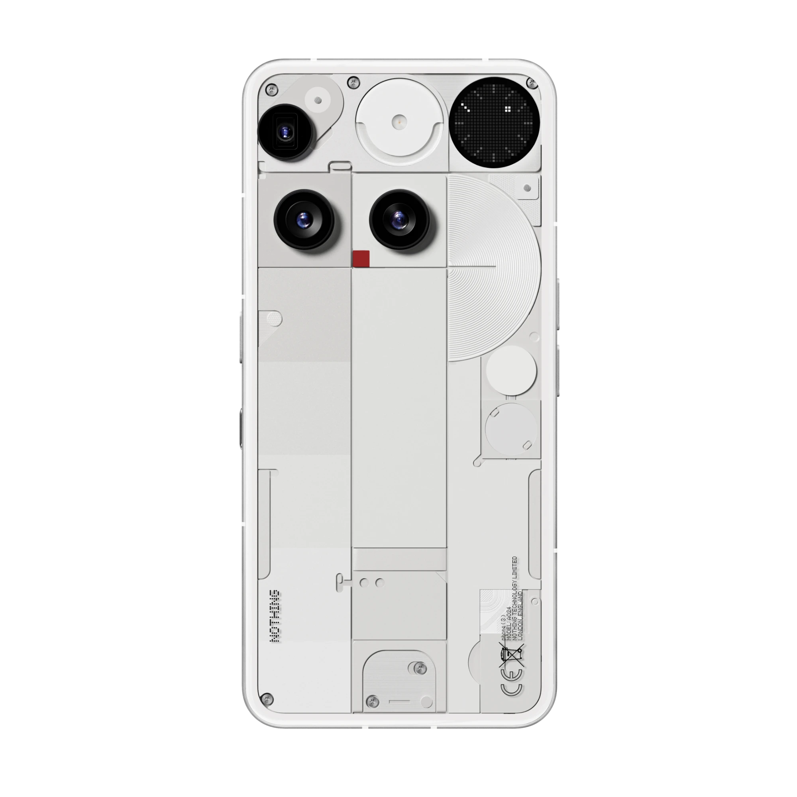
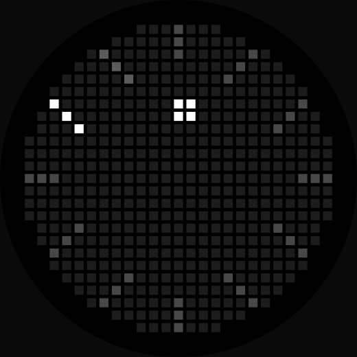

# Orbit Dial: a Glyph Matrix clock toy for the Nothing Phone (3)

[Phone (4a) Pro](README.md) &nbsp;|&nbsp; **Phone (3)**

An always-on clock for the Glyph Matrix on the back of the Nothing Phone (3), written in Kotlin
as a Glyph Toy. Twelve scales around the rim, the current hour lit, and a block orbiting inside
them for the minute. The same app runs on the Phone (4a) Pro; its page is [here](README.md).

<p align="center">
  
</p>

> Built for digital minimalists, this clock provides just enough information to keep you grounded
> in the present, without the noise of seconds and numbers.

The app has no interface. There is no activity in the manifest and no launcher icon: once
installed it exists only inside the Glyph interface.

## Requirements

**To run it:** a Nothing Phone (3). The toy registers for whichever phone it runs on,
`Glyph.DEVICE_23112` or `Glyph.DEVICE_25111p`, and has been built and tested on the Phone (3) and
the Phone (4a) Pro.

**To build it:** JDK 17, Android SDK platform 37, and the Gradle wrapper in the repository
(Gradle 9.7.1, Android Gradle Plugin 9.4.0).

## Install

Each release has one APK per phone. Download `glyph-orbit-dial-v0.3-phone3-release.apk` from the
[Releases](../../releases) page, or build it as below. Then:

```bash
adb install glyph-orbit-dial-v0.3-phone3-release.apk    # -r over an earlier version
```

On the phone: **Settings > Glyph Interface > Flip to Glyph > Always-on Glyph Toy**, choose
**Orbit Dial**, and turn the phone face down.

To remove it: `adb uninstall com.kexsam.orbitdial`. The app changes no system settings, so there is
nothing else to undo.

## Build from source

The Glyph Matrix SDK is not in this repository. Nothing's licence forbids redistribution, so the
build fetches it:

```bash
tools/fetch_sdk.sh        # fetches glyph-matrix-sdk-2.0.aar from the developer kit into libs/
./gradlew assemblePhone3Debug   # -> app/build/outputs/apk/phone3/debug/glyph-orbit-dial-v0.3-phone3-debug.apk
./gradlew testPhone3DebugUnitTest testPhone4aProDebugUnitTest   # the dial's numbers, as tests, on the JVM
```

The script is pinned to one commit of the
[GlyphMatrix Developer Kit](https://github.com/Nothing-Developer-Programme/GlyphMatrix-Developer-Kit)
and checks the aar's SHA-256, so a clean checkout builds against the SDK the toy was tested
with; the commit and hash are at the top of the script. Or place the aar at
`libs/glyph-matrix-sdk-2.0.aar` yourself. A GitHub Actions workflow runs the same fetch, checks
that the generated images match the code, and runs the tests and a debug build on every push.

`./gradlew assembleRelease` signs both release APKs with the credentials in a `keystore.properties`
at the project root (or `ORBIT_DIAL_STORE_FILE`, `_STORE_PASSWORD`, `_KEY_ALIAS`, `_KEY_PASSWORD`
in the environment). Without them it still builds and emits
`glyph-orbit-dial-v0.3-<phone>-release-unsigned.apk`, which a phone will not install.

The two phones are two product flavours, `phone3` and `phone4aPro`. The manifest names the Glyph
Toys preview as one drawable and Android cannot pick a resource by phone model, so each flavour
carries its own `res/drawable/ic_toy_preview.xml`; everything else is shared.

## How it works

### Reading the dial
<p align="center">
  
</p>

Two hours in fourteen seconds. The twelve scales are the hours, the lit one is now. The block
inside them is the minute, orbiting once an hour, and it moves in steps because the ring it
follows passes through 42 positions rather than sixty (more on that below). When it comes round,
the lit scale moves on by one.

The animation is generated from the same numbers as the panel by `tools/make_preview.py`, which
also writes it as `docs/orbit-dial-phone-3.lottie.json` for anywhere with a Lottie player.

Everything below described as measured was measured against the developer kit at commit
`999b1143`, on a Phone (3) on Nothing OS C5.0-260921-0124 (Android 17, security patch 2026-10-01, Glyph service `com.nothing.hearthstone` 5.0.0). Observed firmware behaviour is not an API contract; the kit's own
statements are quoted as such.

### One frame

`ClockFace.render(hour, minute, side, dial)` returns an `IntArray` of `side * side` brightness
values, row-major, one per grid position, 0 for off. It draws the twelve scales at `dim`, the
current hour's scale at `full`, then the minute mark at `full`; where they overlap the brighter
value wins, and positions with no LED behind them are dropped. The service hands that array to
`GlyphMatrixManager.setMatrixFrame` when `EVENT_AOD` arrives, and on every minute boundary itself,
unless it is identical to the last one. `ClockFace` has no Android imports, so the dial is tested
on the JVM: `Phone3Test` holds the numbers this page states and five golden frames.

The five numbers it draws from are the fields of `Dial`. The Phone (3)'s are `Dial.PHONE_3`,
chosen by `Dial.defaultFor(side)`:

| | shipped | what it does |
|---|---|---|
| `full` | 2047 | the current hour and the minute mark |
| `dim` | 575 | the other eleven scales |
| `scaleLength` | 3 | cells per scale, counted inward from the rim |
| `minuteOrbit` | 6.0 | the minute mark's ring, in cells from the centre |
| `minuteSize` | 2 | the minute mark's side, in cells |

### Always-on, and nothing on the Glyph Button

From the developer kit's device table:

| Device | Identifier | Matrix | Glyph Touch | Toy types |
|---|---|---|---|---|
| Phone (3) | `Glyph.DEVICE_23112` | 25 x 25 | Yes | All |
| Phone (4a) Pro | `Glyph.DEVICE_25111p` | 13 x 13 | No | AOD only |

Orbit Dial is an always-on toy here too: chosen once as the always-on toy, it declares
`com.nothing.glyph.toy.aod_support` in its manifest and shows the time, redrawing when
`EVENT_AOD` arrives. It declares no `toy.longpress`; measured, a long press of the Glyph Button
sends the toy nothing and changes nothing on the panel.

It is also in the Glyph Toys list and carousel, where a visit gets no `EVENT_AOD` (measured: a
preview bound for 120 s with no tick). The service therefore redraws on every minute boundary
itself; on an always-on bind that lands a few milliseconds after `EVENT_AOD`, finds the frame
unchanged and pushes nothing. Measured on a Glyph Toys preview with the screen on, the redraws
landed at `00:26:00.135` and `00:27:00.156`. A visit lasts as long as the toy timeout the user sets
in Glyph Toys.

`Common.is23112()` compares `Build.MODEL` against `Glyph.DEVICE_23112`, which is the string
`"A024"`. `Common.getDeviceMatrixLength()` returns 25.

### The LED mask is a circle of radius `side / 2`

Only 489 of the 25 x 25 grid's 625 positions have an LED behind them. The kit publishes the
allocation as a diagram rather than as data, but the shape is exactly a disc:

```kotlin
fun hasLed(col: Int, row: Int, side: Int): Boolean {
    val c = (side - 1) / 2.0
    return hypot(col - c, row - c) <= side / 2.0
}
```

Checked cell by cell against the kit's own Phone (3) icon specification, `image/23112_spec.svg`,
whose grids carry exactly these 489 squares. No table is needed.

### `setMatrixFrame` brightness is 0 to 2047, not 0 to 255

This is the one worth knowing before writing a toy.

The kit documents `GlyphMatrixObject.getBrightness()` as `(0-255, default: 255)`, and that is
accurate for that class. It is not the range of the raw `int[]` handed to
`GlyphMatrixManager.setMatrixFrame(int[])`, which reaches further. The stock toys use the wider
range: reading `finalColors` in logcat while `com.nothing.hearthstone` is on the panel shows values
of `2047`, which is 2^11 - 1 (measured on the Phone (4a) Pro). A toy written to the documented
0-255 sends about an eighth of the value the stock ones do.

The same log line shows what your own toy sends. On the Phone (3) this app's frames read
`{575: 33, 2047: 7}`: the panel takes the full range.

### Brightness is set on the panel, not on a screen

The LEDs' response near the bottom of their range is not a display's, so a fraction of full that
looks right in a mock can read as off on the panel, and a dial designed as twelve scales becomes
one lit mark alone on a dark disc. `dim`, the eleven quiet scales, is 575 (28 per cent of 2047), a
value read on the LEDs rather than computed. Treat any brightness taken from a mock as a starting
point; the debug build lets you move it on the panel without a rebuild (see Remix).

### `EVENT_AOD` lands on the wall-clock minute

The kit says an AOD toy receives `EVENT_AOD` "every minute". Measured on the Phone (3), it lands on
the minute boundary:

```
23:48:00.012   23:49:00.014   23:50:00.019
```

Within about 20 ms. A clock therefore needs no timer of its own for the always-on panel, and the
first interval after a bind is short rather than a full minute. An unchanged frame is not pushed.

### Hour scales are straight strokes from the rim

Each scale is a straight line of `scaleLength` cells along whichever of the eight grid directions
points most nearly at the centre, starting on the rim (its first cell is an LED and the next one
outward is not), placed where its cells sit closest to the hour's angle on average:

```kotlin
val (dx, dy) = DIRECTIONS.maxByOrNull { (x, y) -> (x * inX + y * inY) / hypot(x.toDouble(), y.toDouble()) }!!
for (c in 0 until side) for (r in 0 until side) {
    if (!hasLed(c, r, side) || hasLed(c - dx, r - dy, side)) continue
    val cells = (0 until length).map { k -> (c + dx * k) to (r + dy * k) }
    // keep the line whose cells are nearest the hour's angle
}
```

Straight lines keep all twelve scales reading as even ticks aimed at the middle. At one o'clock
the cells are `(18,2)`, `(17,3)` and `(16,4)`.

### A 25 x 25 grid still cannot show sixty minute positions

The ring the minute mark travels passes through fewer cells than sixty, so the mark stands still
for whole minutes at a time. The 2 x 2 mark at orbit 6.0 lands on 42 distinct positions in an
hour, stands still for up to 2 minutes, and never touches a scale. `ClockFace.minutePositions`
computes the position count for whatever dial is loaded, and the service logs it at bind.

The mark is 2 x 2 because a single LED is too faint to pick out. Where its corner lands exactly on
a half cell, it rounds up with a 1e-9 tolerance (`ClockFace.toCell`), so the last bit of a cosine
cannot move it between the phone, the tests and the generated images.

### A toy service with no launcher activity is still listed

An Android package that has never been launched sits in the stopped state, and components of a
stopped package are normally filtered out of intent resolution. An app with no activity can never
be launched, so its `com.nothing.glyph.TOY` service might never be listed.

Measured: it is listed anyway. On the Phone (4a) Pro the package reports `stopped=true
notLaunched=true`, and on both phones `cmd package query-services -a com.nothing.glyph.TOY`
returns the service alongside the stock ones. An interface-free Glyph Toy is viable.

## Project layout

```
app/src/main/AndroidManifest.xml            the toy service, its metadata, no activity
app/src/main/kotlin/com/kexsam/orbitdial/
  ClockFace.kt                              the dial as one frame of brightness; no Android imports
  Dial.kt                                   the five numbers that decide what it looks like, per phone
  ClockToyService.kt                        the bound Service the system talks to
app/src/main/res/values/strings.xml         the toy's name and summary
app/src/phone3/res/drawable/ic_toy_preview.xml      the Glyph Toys list icon on a Phone (3), generated
app/src/phone4aPro/res/drawable/ic_toy_preview.xml  the same on a Phone (4a) Pro, generated
app/src/test/kotlin/com/kexsam/orbitdial/
  ClockFaceTest.kt                          the Phone (4a) Pro numbers and five golden frames
  Phone3Test.kt                             the Phone (3) numbers and five golden frames
  DialTest.kt                               what a tuned value is clamped to
app/src/debug/AndroidManifest.xml           adds TuneReceiver to debug builds only
app/src/debug/kotlin/com/kexsam/orbitdial/
  TuneReceiver.kt                           changes the dial over adb
.github/workflows/build.yml                 CI: fetch the pinned SDK, check the images, test, debug build
tools/
  fetch_sdk.sh                              fetches the SDK aar, which is not committed
  make_preview.py                           regenerates both icons and everything in docs/ from Dial
  tuner.py                                  an HTTP front end for the adb tuning commands
docs/
  hero.webp                                 the toy on a Phone (4a) Pro
  hero-phone-3.webp                         the toy on a Phone (3)
  orbit-dial-hours.svg                      two hours of the Phone (4a) Pro dial, animated
  orbit-dial.lottie.json                    the same animation as Lottie
  orbit-dial.svg                            one frame on the Phone (4a) Pro, still
  orbit-dial-phone-3.svg                    one frame on the Phone (3), still
  orbit-dial-phone-3-hours.svg              two hours of the Phone (3) dial, animated
  orbit-dial-phone-3.lottie.json            the same animation as Lottie
```

## Remix

MIT licensed: use it, change it, republish it, keep the notice.

### Change the face

Edit `Dial.PHONE_3` in `Dial.kt`, then:

```bash
python3 tools/make_preview.py   # regenerates both list icons and docs/ from the new numbers
./gradlew assemblePhone3Debug
adb install -r app/build/outputs/apk/phone3/debug/glyph-orbit-dial-v0.3-phone3-debug.apk
```

The icons and the images in `docs/` are generated from `Dial` rather than drawn, so they always
show the face the toy actually has.

### Try values on the panel first

A **debug** build can be changed over adb, without a rebuild, while the dial is showing:

```bash
adb shell am broadcast -n com.kexsam.orbitdial/.TuneReceiver -a com.kexsam.orbitdial.TUNE --ei dim 575
adb shell am broadcast -n com.kexsam.orbitdial/.TuneReceiver -a com.kexsam.orbitdial.TUNE --ef minute_orbit 6.0
adb shell am broadcast -n com.kexsam.orbitdial/.TuneReceiver -a com.kexsam.orbitdial.TUNE --ez reset true
```

The extras are `full`, `dim`, `scale_length`, `minute_size` (`--ei`) and `minute_orbit` (`--ef`);
`reset` returns to the panel's shipped face. The component must be named: a manifest-declared
receiver does not get implicit broadcasts on current Android, so `am broadcast -a
com.kexsam.orbitdial.TUNE` alone completes and does nothing.

`tools/tuner.py` puts an HTTP endpoint in front of those commands, for a slider or any other
client:

```bash
python3 tools/tuner.py                     # finds the attached Phone (3) or (4a) Pro, listens on 127.0.0.1:8732
python3 tools/tuner.py --serial <serial>   # when more than one device is attached
```

```
POST /set   {"full": 2047, "dim": 575, "scale_length": 3, "minute_orbit": 6.0, "minute_size": 2}
GET  /      {"ok": true, "serial": "…", "fields": [...]}
```

Send only the fields you want to change. The service clamps whatever arrives to what the panel
can draw (`Dial.clamped`: brightness 0 to 2047, `dim` no brighter than `full`, sizes and orbit
within the disc), so a stray value cannot make the panel lie. Once a value is right, put it in
`Dial.PHONE_3`. `TuneReceiver` and its manifest entry are both in `src/debug`, so a release build
has neither and its dial cannot be moved.

### Change the drawing

`ClockFace.render` is the whole face. `hasLed` is the mask, `scaleRay` draws a scale,
`minuteCells` places the minute mark, and anything that fills a row-major `IntArray` of
`side * side` values from 0 to 2047 will show. `ClockFace` has no Android imports, so a new face
can be checked in a plain Kotlin test before it goes near a phone.

### Make it yours

Change `applicationId` and `namespace` in `app/build.gradle.kts` so your build installs beside
this one, the three strings in `res/values/strings.xml` (`toy_name` and `toy_summary` are what
the Glyph Toys list shows), and sign the release with your own key as described under Build from
source.

## Releases

| | date | what changed |
|---|---|---|
| v0.3 | 28/09/2026 | Phone (3) support: its own face (three-cell scales, orbit 6.0), its own Glyph Toys preview, one APK per phone, and a redraw on every minute boundary so a Glyph Toys preview keeps time. Scales are straight strokes on both phones, the same cells as before on the Phone (4a) Pro. `dim` is 575 on both. The minute mark's half-cell rounding is the same on every platform |
| v0.2 | 26/09/2026 | Same dial. The SDK fetch is pinned to one kit commit with the aar's SHA-256 checked; 24 JVM tests and CI; the service ignores SDK callbacks after unbind, redraws in full after a Glyph service disconnect, and clamps a debug build's values to what the panel can draw; `minutePositions` counts visible positions; log tag `OrbitDial` |
| v0.1 | 26/09/2026 | First release |

Each release's APKs are signed with the same key; their SHA-256s and the signing certificate's are
in the release notes.

## Licence and notices

This project's code is MIT licensed; see `LICENSE`. Copyright remains with Keith Chan. Use it,
remix it, republish it, keep the notice.

The Glyph Matrix SDK is Nothing's, under their EULA, which forbids redistribution and commercial
use without written permission. The aar is not in this repository; `tools/fetch_sdk.sh` fetches
it, and that licence binds whoever does. See `NOTICE.md`.

The phone renders in `docs/hero.webp` and `docs/hero-phone-3.webp` are Nothing's and are not
covered by the MIT licence.

Device geometry, identifiers and matrix lengths come from Nothing's public
[GlyphMatrix Developer Kit](https://github.com/Nothing-Developer-Programme/GlyphMatrix-Developer-Kit).

## Acknowledgements

The [GlyphMatrix Developer Kit](https://github.com/Nothing-Developer-Programme/GlyphMatrix-Developer-Kit)
for the SDK, the device table, the LED allocation diagram and the icon specifications.
