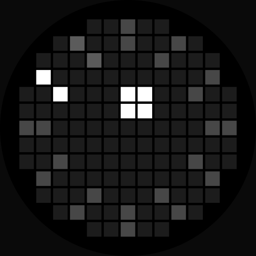

# Orbit Dial: a Glyph Matrix clock toy for the Nothing Phone (4a) Pro

An always-on clock for the Glyph Matrix on the back of the Nothing Phone (4a) Pro, written in
Kotlin as a Glyph Toy. Twelve scales around the rim, the current hour lit, and a block orbiting
inside them for the minute.

<p align="center">
  
</p>

> Built for digital minimalists, this clock provides just enough information to keep you grounded
> in the present, without the noise of seconds and numbers.

The app has no interface. There is no activity in the manifest and no launcher icon: once
installed it exists only inside the Glyph interface.

## Requirements

**To run it:** a Nothing Phone (4a) Pro. The toy registers for `Glyph.DEVICE_25111p`
unconditionally and has been built and tested for that device only.

**To build it:** JDK 17, Android SDK platform 37, and the Gradle wrapper in the repository
(Gradle 9.7.1, Android Gradle Plugin 9.4.0).

## Install

Download `glyph-orbit-dial-<version>-release.apk` from the
[Releases](../../releases) page, or build it as below. Then:

```bash
adb install glyph-orbit-dial-v0.2-release.apk    # -r over an earlier version
```

On the phone: **Settings > Glyph Interface > Flip to Glyph > Always-on Glyph Toy**, choose
**Orbit Dial**, and turn the phone face down.

To remove it: `adb uninstall com.kexsam.orbitdial`. The app changes no system settings, so there is
nothing else to undo.

## Build from source

The Glyph Matrix SDK is not in this repository. Nothing's licence forbids redistribution, so the
build fetches it:

```bash
tools/fetch_sdk.sh        # fetches glyph-matrix-sdk-2.0.aar from the developer kit into libs/
./gradlew assembleDebug   # -> app/build/outputs/apk/debug/glyph-orbit-dial-v0.2-debug.apk
./gradlew testDebugUnitTest   # the dial's numbers, as tests, on the JVM
```

The script is pinned to one commit of the
[GlyphMatrix Developer Kit](https://github.com/Nothing-Developer-Programme/GlyphMatrix-Developer-Kit)
and checks the aar's SHA-256, so a clean checkout builds against the SDK the toy was tested
with; the commit and hash are at the top of the script. Or place the aar at
`libs/glyph-matrix-sdk-2.0.aar` yourself. A GitHub Actions workflow runs the same fetch, the
tests and a debug build on every push.

`./gradlew assembleRelease` signs the release APK with the credentials in a `keystore.properties`
at the project root (or `ORBIT_DIAL_STORE_FILE`, `_STORE_PASSWORD`, `_KEY_ALIAS`, `_KEY_PASSWORD`
in the environment). Without them it still builds and emits
`glyph-orbit-dial-v0.2-release-unsigned.apk`, which a phone will not install.

## How it works

### Reading the dial

<p align="center">
  
</p>

Two hours in fourteen seconds. The twelve scales are the hours, the lit one is now. The block
inside them is the minute, orbiting once an hour, and it moves in steps because the ring it
follows passes through only twelve cells (more on that below). When it comes round, the lit scale
moves on by one.

The animation is generated from the same numbers as the panel by `tools/make_preview.py`, which
also writes it as `docs/orbit-dial.lottie.json` for anywhere with a Lottie player.

Everything below described as measured was measured on a Nothing Phone (4a) Pro on Nothing OS
build C5.0-260902-1559 (Android 17, security patch 2026-09-01), Glyph service
`com.nothing.hearthstone` 3.6.0, against the developer kit at commit `999b1143`. Observed
firmware behaviour is not an API contract; the kit's own statements are quoted as such.

### One frame

`ClockFace.render(hour, minute, side, dial)` returns an `IntArray` of `side * side` brightness
values, row-major, one per grid position, 0 for off. It draws the twelve scales at `dim`, the
current hour's scale at `full`, then the minute mark at `full`; where they overlap the brighter
value wins, and positions with no LED behind them are dropped. The service hands that array to
`GlyphMatrixManager.setMatrixFrame` when `EVENT_AOD` arrives, unless it is identical to the last
one. `ClockFace` has no Android imports, so the dial is tested on the JVM: `ClockFaceTest` holds the
numbers this page states (137 LEDs, 12 minute positions, 0.80 LEDs a minute, the one o'clock
diagonal) and five golden frames.

The five numbers it draws from are the fields of `Dial`:

| | shipped | what it does |
|---|---|---|
| `full` | 2047 | the current hour and the minute mark |
| `dim` | 614 | the other eleven scales |
| `scaleLength` | 2 | cells per scale, counted inward from the rim |
| `minuteOrbit` | 1.5 | the minute mark's ring, in cells from the centre |
| `minuteSize` | 2 | the minute mark's side, in cells |

### The device decides the shape of the app: AOD only, no Glyph Touch

From the developer kit's device table:

| Device | Identifier | Matrix | Glyph Touch | Toy types |
|---|---|---|---|---|
| Phone (4a) Pro | `Glyph.DEVICE_25111p` | 13 x 13 | No | AOD only |

No touch to react to and no carousel visit to animate for. The toy is chosen once as the
always-on toy, declares `com.nothing.glyph.toy.aod_support` in its manifest, and then shows the
time, redrawing when `EVENT_AOD` arrives. A clock is one of the few things that fits that brief
rather than fighting it.

`Common.is25111p()` compares `Build.MODEL` against `Glyph.DEVICE_25111p`, which is the string
`"A069P"`. `Common.getDeviceMatrixLength()` returns 13.

### The LED mask is a circle of radius `side / 2`

Only 137 of the 13 x 13 grid's 169 positions have an LED behind them. The kit publishes the
allocation as a diagram rather than as data, but the shape is exactly a disc:

```kotlin
fun hasLed(col: Int, row: Int, side: Int): Boolean {
    val c = (side - 1) / 2.0
    return hypot(col - c, row - c) <= side / 2.0
}
```

Checked cell by cell against the kit's own `image/23111_25111_LED_allocation.svg`, which marks
absent positions with `fill-opacity="0.1"`. No table is needed.

### `setMatrixFrame` brightness is 0 to 2047, not 0 to 255

This is the one worth knowing before writing a toy.

The kit documents `GlyphMatrixObject.getBrightness()` as `(0-255, default: 255)`, and that is
accurate for that class. It is not the range of the raw `int[]` handed to
`GlyphMatrixManager.setMatrixFrame(int[])`, which reaches further. The stock toys use the wider
range: reading `GlyphService: finalColors` in logcat while `com.nothing.hearthstone` is on the
panel shows values of `2047`, which is 2^11 - 1. A toy written to the documented 0-255 sends
about an eighth of the value the stock ones do.

The same log line shows what your own toy sends. This app's frames read
`levels={614: 22, 2047: 6}`.

### Brightness is set on the panel, not on a screen

The LEDs' response near the bottom of their range is not a display's, so a fraction of full that
looks right in a mock can read as off on the panel, and a dial designed as twelve scales becomes
one lit mark alone on a dark disc. `dim`, the eleven quiet scales, is 614 (30 per cent of 2047)
and was settled by looking at the phone. Treat any brightness taken from a mock as a starting
point; the debug build lets you move it on the panel without a rebuild (see Remix).

### `EVENT_AOD` lands on the wall-clock minute

The kit says an AOD toy receives `EVENT_AOD` "every minute". Measured on the (4a) Pro, it lands on
the minute boundary:

```
13:21:00.011   13:22:00.010   13:23:00.021
```

Within about 20 ms. A clock therefore needs no timer of its own, and the first interval after a
bind is short rather than a full minute. An unchanged frame is not pushed.

### Hour scales are drawn as rays stepping inward

Each scale is the rim cell for its hour, then a walk inward one grid step at a time, in whichever
of the eight directions points most nearly at the centre:

```kotlin
var (c, r) = polarCell(outer, deg, side)
for (k in 1 until length) {
    val dx = centre - c
    val dy = centre - r
    val m = hypot(dx, dy)
    if (m < 0.5) break
    c += (dx / m).roundToInt()
    r += (dy / m).roundToInt()
}
```

Stepping keeps each scale reading as a stroke aimed at the middle: at one o'clock the two cells
are `(9,1)` and `(8,2)`, a diagonal, and on the panel the dial reads as twelve ticks.

### A 13 x 13 grid cannot show sixty minute positions

The ring the minute mark travels passes through far fewer cells than sixty, so the mark stands
still for whole minutes at a time. The shipped 2 x 2 mark at orbit 1.5 lands on 12 distinct
positions in an hour, changes 0.80 LEDs a minute on average, and stands still for up to 7
minutes. `ClockFace.minutePositions` computes the position count for whatever dial is loaded,
and the service logs it at bind.

Orbit 1.5 keeps the mark two cells clear of the hour scales. The mark is 2 x 2 because a single
LED is too faint to pick out on this panel.

### A toy service with no launcher activity is still listed

An Android package that has never been launched sits in the stopped state, and components of a
stopped package are normally filtered out of intent resolution. An app with no activity can never
be launched, so its `com.nothing.glyph.TOY` service might never be listed.

Measured: it is listed anyway. The package reports `stopped=true notLaunched=true`, and
`cmd package query-services -a com.nothing.glyph.TOY` returns the service alongside the stock
ones. An interface-free Glyph Toy is viable.

## Project layout

```
app/src/main/AndroidManifest.xml            the toy service, its metadata, no activity
app/src/main/kotlin/com/kexsam/orbitdial/
  ClockFace.kt                              the dial as one frame of brightness; no Android imports
  Dial.kt                                   the five numbers that decide what it looks like
  ClockToyService.kt                        the bound Service the system talks to
app/src/main/res/
  drawable/ic_toy_preview.xml               the Glyph Toys list icon, generated
  values/strings.xml                        the toy's name and summary
app/src/test/kotlin/com/kexsam/orbitdial/
  ClockFaceTest.kt                          the README's numbers and five golden frames, as tests
app/src/debug/AndroidManifest.xml           adds TuneReceiver to debug builds only
app/src/debug/kotlin/com/kexsam/orbitdial/
  TuneReceiver.kt                           changes the dial over adb
.github/workflows/build.yml                 CI: fetch the pinned SDK, test, debug build
tools/
  fetch_sdk.sh                              fetches the SDK aar, which is not committed
  make_preview.py                           regenerates the icon and everything in docs/ from Dial
  tuner.py                                  an HTTP front end for the adb tuning commands
docs/
  hero.webp                                 the toy on the phone, at the top of this page
  orbit-dial-hours.svg                      the animation above, two hours of the dial
  orbit-dial.lottie.json                    the same animation as Lottie
  orbit-dial.svg                            one frame of the dial, still
```

## Remix

MIT licensed: use it, change it, republish it, keep the notice.

### Change the face

Edit `Dial.DEFAULT` in `Dial.kt`, then:

```bash
python3 tools/make_preview.py   # regenerates the list icon and docs/ from the new numbers
./gradlew assembleDebug
adb install -r app/build/outputs/apk/debug/glyph-orbit-dial-v0.2-debug.apk
```

The icon and the images in `docs/` are generated from `Dial` rather than drawn, so they always
show the face the toy actually has.

### Try values on the panel first

A **debug** build can be changed over adb, without a rebuild, while the dial is showing:

```bash
adb shell am broadcast -n com.kexsam.orbitdial/.TuneReceiver -a com.kexsam.orbitdial.TUNE --ei dim 614
adb shell am broadcast -n com.kexsam.orbitdial/.TuneReceiver -a com.kexsam.orbitdial.TUNE --ef minute_orbit 1.5
adb shell am broadcast -n com.kexsam.orbitdial/.TuneReceiver -a com.kexsam.orbitdial.TUNE --ez reset true
```

The extras are `full`, `dim`, `scale_length`, `minute_size` (`--ei`) and `minute_orbit` (`--ef`);
`reset` returns to `Dial.DEFAULT`. The component must be named: a manifest-declared receiver
does not get implicit broadcasts on current Android, so `am broadcast -a com.kexsam.orbitdial.TUNE`
alone completes and does nothing.

`tools/tuner.py` puts an HTTP endpoint in front of those commands, for a slider or any other
client:

```bash
python3 tools/tuner.py          # finds the (4a) Pro, listens on 127.0.0.1:8732
```

```
POST /set   {"full": 2047, "dim": 614, "scale_length": 2, "minute_orbit": 1.5, "minute_size": 2}
GET  /      {"ok": true, "serial": "…", "fields": [...]}
```

Send only the fields you want to change. The service clamps whatever arrives to what the panel
can draw (`Dial.clamped`: brightness 0 to 2047, `dim` no brighter than `full`, sizes and orbit
within the disc), so a stray value cannot make the panel lie. Once a value is right, put it in
`Dial.DEFAULT`.
`TuneReceiver` and its manifest entry are both in `src/debug`, so a release build has neither
and its dial cannot be moved.

### Change the drawing

`ClockFace.render` is the whole face. `hasLed` is the mask, `scaleRay` draws a scale, and
anything that fills a row-major `IntArray` of `side * side` values from 0 to 2047 will show.
`ClockFace` has no Android imports, so a new face can be checked in a plain Kotlin test before it
goes near a phone.

### Make it yours

Change `applicationId` and `namespace` in `app/build.gradle.kts` so your build installs beside
this one, the three strings in `res/values/strings.xml` (`toy_name` and `toy_summary` are what
the Glyph Toys list shows), and sign the release with your own key as described under Build from
source.

## Releases

| | date | what changed |
|---|---|---|
| v0.2 | 26/09/2026 | Same dial. The SDK fetch is pinned to one kit commit with the aar's SHA-256 checked; 24 JVM tests and CI; the service ignores SDK callbacks after unbind, redraws in full after a Glyph service disconnect, and clamps a debug build's values to what the panel can draw; `minutePositions` counts visible positions; log tag `OrbitDial` |
| v0.1 | 26/09/2026 | First release |

Each release's APK is signed with the same key; its SHA-256 and the signing certificate's are
in the release notes.

## Licence and notices

This project's code is MIT licensed; see `LICENSE`. Copyright remains with Keith Chan. Use it,
remix it, republish it, keep the notice.

The Glyph Matrix SDK is Nothing's, under their EULA, which forbids redistribution and commercial
use without written permission. The aar is not in this repository; `tools/fetch_sdk.sh` fetches
it, and that licence binds whoever does. See `NOTICE.md`.

The phone render in `docs/hero.webp` is Nothing's and is not covered by the MIT licence.

Device geometry, identifiers and matrix lengths come from Nothing's public
[GlyphMatrix Developer Kit](https://github.com/Nothing-Developer-Programme/GlyphMatrix-Developer-Kit).

## Acknowledgements

The [GlyphMatrix Developer Kit](https://github.com/Nothing-Developer-Programme/GlyphMatrix-Developer-Kit)
for the SDK, the device table and the LED allocation diagram.
