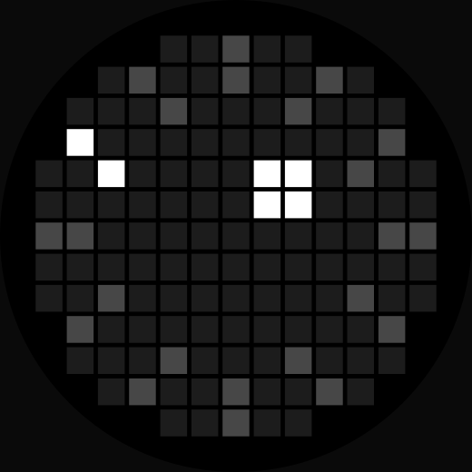

# Orbit Dial：Nothing Phone (4a) Pro 的 Glyph Matrix 時鐘 toy

*[English](README.md)*

一個常亮時鐘，顯示於 Nothing Phone (4a) Pro 背面的 Glyph Matrix，以 Kotlin 寫成的 Glyph Toy。
錶面外圈有十二個刻度，當前的鐘點會亮起，內圈另有一個方塊沿圓周移動，代表分鐘。

<p align="center">
  
</p>

> 為數碼極簡主義者而設。這個時鐘只提供剛剛好的資訊，讓你安於當下，不受秒數與數字的干擾。

程式本身沒有介面。Manifest 內沒有任何 activity，桌面也不會出現圖示；安裝之後，它只存在於 Glyph 介面之中。

## 系統需求

**執行：** Nothing Phone (4a) Pro。Toy 無條件註冊為 `Glyph.DEVICE_25111p`，亦只在這款裝置上建置及測試過。
在其他手機上，它只會記錄一則警告，不會顯示錶面。

**建置：** JDK 17、Android SDK platform 37，以及倉庫內附的 Gradle wrapper（Gradle 9.7.1、Android Gradle
Plugin 9.4.0）。穩定版 Android Studio 可能附帶較舊的 AGP；若 IDE 拒絕開啟專案，請在命令列使用 wrapper。

## 安裝

從 [Releases](../../releases) 頁面下載 `glyph-orbit-dial-<version>-release.apk`，或按下文自行建置，然後：

```bash
adb install glyph-orbit-dial-v0.1-release.apk
```

在手機上前往 **設定 > Glyph Interface > Flip to Glyph > Always-on Glyph Toy**，選擇 **Orbit Dial**，
再把手機反轉向下。

移除只需 `adb uninstall dev.glyphclock`。程式不會改動任何系統設定，因此沒有其他善後工作。

## 從原始碼建置

Glyph Matrix SDK 並不在這個倉庫內。Nothing 的授權條款禁止轉發，所以由建置流程自行取得：

```bash
tools/fetch_sdk.sh        # clone 開發套件，把 glyph-matrix-sdk-2.0.aar 複製到 libs/
./gradlew assembleDebug   # -> app/build/outputs/apk/debug/glyph-orbit-dial-v0.1-debug.apk
```

亦可自行從
[GlyphMatrix Developer Kit](https://github.com/Nothing-Developer-Programme/GlyphMatrix-Developer-Kit)
下載該 aar，放到 `libs/glyph-matrix-sdk-2.0.aar`。

`./gradlew assembleRelease` 會以專案根目錄 `keystore.properties`（或環境變數 `ORBIT_DIAL_STORE_FILE`、
`_STORE_PASSWORD`、`_KEY_ALIAS`、`_KEY_PASSWORD`）內的憑證簽署 release APK。沒有憑證時仍可建置，
但輸出的是 `glyph-orbit-dial-v0.1-release-unsigned.apk`，手機不會接受安裝。

## 運作原理

### 裝置條件決定了程式的形態：只限 AOD，沒有 Glyph Button

開發套件的裝置表：

| 裝置 | 識別字串 | 矩陣 | Glyph Touch | Toy 類型 |
|---|---|---|---|---|
| Phone (4a) Pro | `Glyph.DEVICE_25111p` | 13 × 13 | 無 | 只限 AOD |

沒有按鍵可以回應，也沒有輪播畫面需要動畫。Toy 一經選為常亮 toy，在 manifest 內聲明
`com.nothing.glyph.toy.aod_support`，之後就只是顯示時間，並在收到 `EVENT_AOD` 時重繪。
條件相當窄，而時鐘正是少數能夠順著這些條件、而非與之對抗的東西。

`Common.is25111p()` 會把 `Build.MODEL` 與 `Glyph.DEVICE_25111p` 比較，後者的值是字串 `"A069P"`。
`Common.getDeviceMatrixLength()` 回傳 13。

### LED 遮罩是一個半徑為 `side / 2` 的圓

13 × 13 共 169 個位置之中，只有 137 個位置背後真的有 LED。開發套件以圖片而非資料的形式發佈這份配置，
但它的形狀剛好就是一個圓：

```kotlin
fun hasLed(col: Int, row: Int, side: Int): Boolean {
    val c = (side - 1) / 2.0
    return hypot(col - c, row - c) <= side / 2.0
}
```

這條式逐格核對過開發套件本身的 `image/23111_25111_LED_allocation.svg`，該圖以 `fill-opacity="0.1"`
標示不存在的位置。不需要任何對照表。

### `setMatrixFrame` 的亮度範圍是 0 至 2047，不是 0 至 255

在動手寫 toy 之前，這一點最值得知道。

開發套件把 `GlyphMatrixObject.getBrightness()` 記載為 `(0-255, default: 255)`，就該類別而言並無錯誤；
但這並不是傳給 `GlyphMatrixManager.setMatrixFrame(int[])` 的原始陣列的範圍，後者的上限高得多。
原廠 toy 用的正是較闊的範圍：在 `com.nothing.hearthstone` 的 toy 顯示期間，以 logcat 觀察
`GlyphService: finalColors`，見到的數值是 `2047`，即 2<sup>11</sup> − 1。

因此，按照文件所寫的 0 至 255 去寫的 toy，亮度大約只有原廠的八分之一，並排比較會明顯偏暗。
本程式的畫面在同一份日誌中顯示為 `levels={614: 22, 2047: 6}`。

2047 究竟是硬件上限，抑或只是原廠 toy 選用的數值，尚未驗證。

### 在螢幕上調好的亮度比例，到了 LED 上並不成立

錶面上那批較暗的刻度，原本是在瀏覽器預覽中按全亮的 20% 設定的。到了面板上，這個數值讀出來等於熄滅：
十一個非當前刻度完全消失，整個錶面只剩下一個亮點孤零零地留在暗圓上。最終的數值是對著手機定下來的。

| | 2047 之中 | 面板上的表現 |
|---|---|---|
| 20% | 409 | 刻度讀成熄滅 |
| 30% | 614 | 現行版本 |
| 39% | 800 | 清楚可見，但比預期光 |

LED 在範圍底部的響應，與顯示器並不相同。任何從設計稿取得的亮度比例，只應視為起點，而非最終數值。
`tools/tuner.py` 的作用，就是讓這個起點可以在面板上直接調整，毋須重新建置。

### `EVENT_AOD` 落在整分鐘之上

開發套件只說 AOD toy 會「每分鐘」收到 `EVENT_AOD`。在 (4a) Pro 上實測，它落在分鐘的邊界：

```
13:21:00.011   13:22:00.010   13:23:00.021
```

誤差約在 20 毫秒之內。因此時鐘不需要自己的計時器；另外，綁定之後的第一段間隔比一分鐘短，
而非剛好一分鐘。畫面如果沒有變化，就不會推送。

### 時刻度是逐格向內的射線，不是兩個半徑

每個刻度由該鐘點在外圈的那一格開始，然後逐格向內走，每步都選八個方向之中最指向圓心的一個：

```kotlin
var (c, r) = polarCell(outer, deg, side)
for (k in 1 until length) {
    val dx = centre - c
    val dy = centre - r
    val m = hypot(dx, dy)
    if (m < 0.5) break
    c += (dx / m).roundToInt()
    r += (dy / m).roundToInt()
}
```

比較直覺的做法是以較細的半徑再解一次極座標，但那樣在面板上是錯的。以一點鐘為例，半徑 6 得出 `(9,1)`，
半徑 5 得出 `(9,2)`：兩格同一欄，整個記號讀起來像一對直立的方塊，而不是一支指向中心的刻度。
逐格向內走則得出 `(8,2)`，斜向排列，整個錶面才讀得出是十二個刻度。

### 13 × 13 的格網無法呈現六十個分鐘位置

分鐘記號所走的圓周，經過的格數遠少於六十，因此記號會整分鐘整分鐘地停在原位。以現行的 2 × 2 記號計：

| 軌道半徑（格） | 可分辨位置 | 每分鐘平均變化的 LED 數 | 最長停滯 |
|---|---|---|---|
| 1.0 | 6 | 0.19 | 16 分鐘 |
| 1.5 | 12 | 0.37 | 7 分鐘 |
| 2.0 | 14 | 0.47 | 6 分鐘 |
| 3.0 | 22 | 0.73 | 4 分鐘 |

`ClockFace.minutePositions` 會按當前載入的錶面數值計算第二欄，service 在綁定時亦會把它寫入日誌。

現行版本採用軌道 1.5，令記號與時刻度之間保持兩格距離。記號做成 2 × 2 方塊而非單粒 LED，
是因為單粒 LED 太暗，難以找到。方塊並不比單點走得更遠：兩者沿同一條經取整的路徑移動，
方塊重複同一位置的次數甚至略多；不同之處在於每一步有更多 LED 亮起或熄滅，變化因此較容易察覺。

大小與軌道半徑互相牽連。2 × 2 在軌道 1.5 上不會碰到時刻度，但軌道推到 3.5 時，六十分鐘之中有二十四分鐘
會相撞；4 × 4 則會填滿圓心一帶，佔用 137 粒 LED 之中的 16 粒。

### 沒有啟動 activity 的 toy service，一樣會被列出

從未被啟動過的 Android 套件會處於 stopped 狀態，而 stopped 套件的組件通常會被 intent 解析過濾掉。
完全沒有 activity 的程式永遠無法被啟動，因此它的 `com.nothing.glyph.TOY` service 有可能根本不會出現在清單。

實測結果是照樣出現。該套件回報 `stopped=true notLaunched=true`，而
`cmd package query-services -a com.nothing.glyph.TOY` 依然會把這個 service 連同原廠的一併列出。
沒有介面的 Glyph Toy 是可行的。

## 專案結構

```
app/src/main/AndroidManifest.xml            toy service 及其 metadata，沒有 activity
app/src/main/kotlin/dev/glyphclock/
  ClockFace.kt                              錶面，以一幀亮度資料表示；不引入任何 Android API
  Dial.kt                                   決定錶面外觀的五個數值
  ClockToyService.kt                        系統實際連接的 bound Service
app/src/main/res/
  drawable/ic_toy_preview.xml               Glyph Toys 清單中的圖示，由程式產生
  values/strings.xml                        toy 的名稱與簡介
app/src/debug/AndroidManifest.xml           只在 debug 版本加入 TuneReceiver
app/src/debug/kotlin/dev/glyphclock/
  TuneReceiver.kt                           經 adb 修改錶面數值
tools/
  fetch_sdk.sh                              取得 SDK aar，該檔案並未納入版本控制
  make_preview.py                           由 Dial 重新產生圖示及 docs/orbit-dial.svg
  tuner.py                                  為 adb 調校指令加一層 HTTP 介面
docs/
  orbit-dial.svg                            文首那張圖
```

`ClockFace` 不引入任何 Android API，因此不需要實機也可以驗證錶面。圖示與文首的圖片都是由 `Dial`
的預設值產生而非另行繪製，這樣才能保證它們顯示的正是 toy 實際的錶面。

## 調校

錶面的每一個尺寸，都是 `Dial` 上的一個欄位。

| | 現行值 | 作用 |
|---|---|---|
| `full` | 2047 | 當前鐘點與分鐘記號 |
| `dim` | 614 | 其餘十一個刻度 |
| `scaleLength` | 2 | 每個刻度的格數，由外圈向內計 |
| `minuteOrbit` | 1.5 | 分鐘記號的軌道半徑，以格為單位，由圓心起計 |
| `minuteSize` | 2 | 分鐘記號的邊長，以格為單位 |

**Debug** 版本可以經 adb 調校，毋須重新建置，錶面顯示期間亦可直接改：

```bash
adb shell am broadcast -n dev.glyphclock/.TuneReceiver -a dev.glyphclock.TUNE --ei dim 800
adb shell am broadcast -n dev.glyphclock/.TuneReceiver -a dev.glyphclock.TUNE --ef minute_orbit 2.0
adb shell am broadcast -n dev.glyphclock/.TuneReceiver -a dev.glyphclock.TUNE --ez reset true
```

必須指明 component。在現行版本的 Android 上，manifest 宣告的 receiver 收不到 implicit broadcast，
因此 `am broadcast -a dev.glyphclock.TUNE` 只會回報 `Broadcast completed: result=0`，然後甚麼都不做。

`TuneReceiver` 與它的 manifest 條目同樣位於 `src/debug`，因此 release 版本兩者皆無，錶面數值也就無從修改。

`tools/tuner.py` 會在上述指令前面加一層 HTTP 介面，供滑桿或任何其他客戶端使用：

```bash
python3 tools/tuner.py          # 自動尋找 (4a) Pro，監聽 127.0.0.1:8732
```

```
POST /set   {"full": 2047, "dim": 800, "scale_length": 2, "minute_orbit": 1.5, "minute_size": 2}
GET  /      {"ok": true, "serial": "…", "fields": [...]}
```

只需傳送想修改的欄位。

## 授權與聲明

本專案的程式碼採用 MIT 授權，詳見 `LICENSE`。版權仍屬 Keith Chan；歡迎使用、改作、再發佈，保留授權聲明即可。

Glyph Matrix SDK 屬於 Nothing，受其 EULA 規範，禁止轉發，亦禁止在未獲書面許可下作商業用途。
該 aar 並不在本倉庫內，由 `tools/fetch_sdk.sh` 取得，而該授權同樣約束取得它的人。詳見 `NOTICE.md`。

裝置幾何、識別字串與矩陣尺寸均來自 Nothing 公開的
[GlyphMatrix Developer Kit](https://github.com/Nothing-Developer-Programme/GlyphMatrix-Developer-Kit)。

## 鳴謝

感謝 [GlyphMatrix Developer Kit](https://github.com/Nothing-Developer-Programme/GlyphMatrix-Developer-Kit)
提供 SDK、裝置表與 LED 配置圖。

其他值得一讀的開源 Glyph Matrix toy，當中數個同樣以這款裝置為目標：
[glyph-life](https://github.com/Yuma-Eimymk2/glyph-life)、
[Toyph](https://github.com/antonvidishchev/toyph)、
[GlyphStopwatch](https://github.com/Sturdy7435/GlyphStopwatch)、
[GlyphMarquee](https://github.com/bluehomewu/GlyphMarquee)、
[GlyphMatrix-AODGeekBox](https://github.com/danissomo/GlyphMatrix-AODGeekBox)、
[GlyphMatrixEditor](https://github.com/pauwma/GlyphMatrixEditor)。
